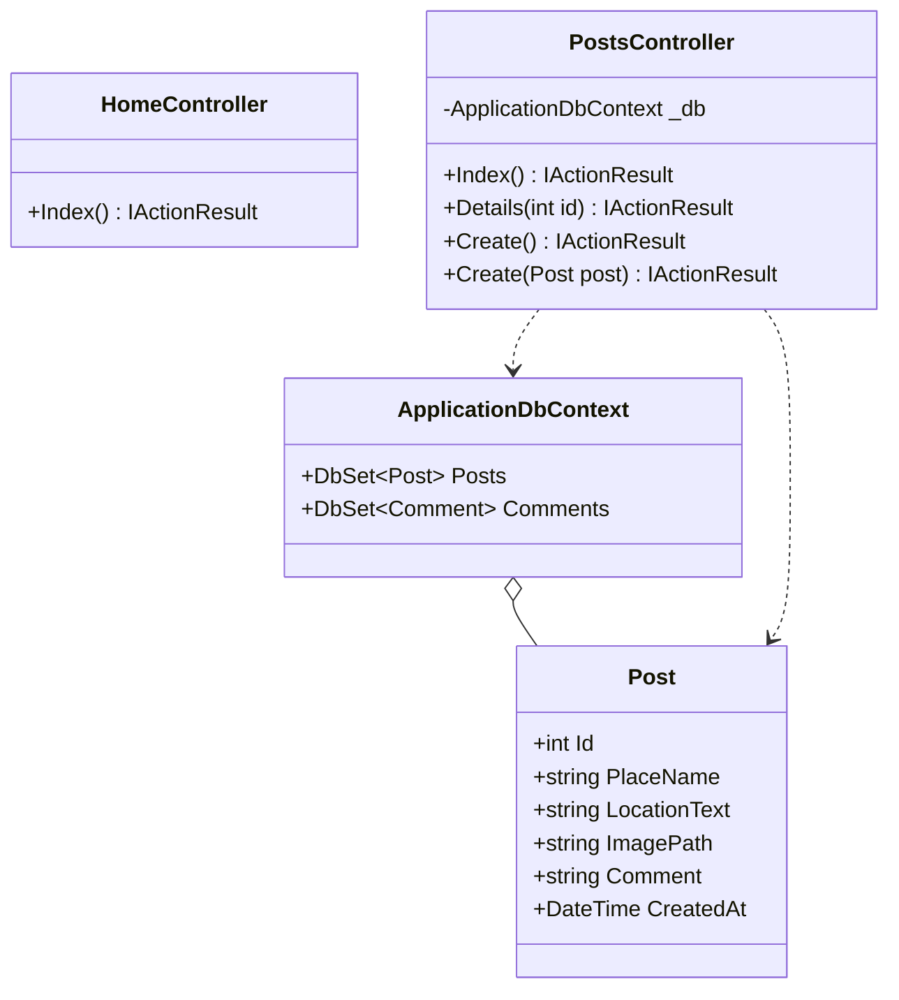
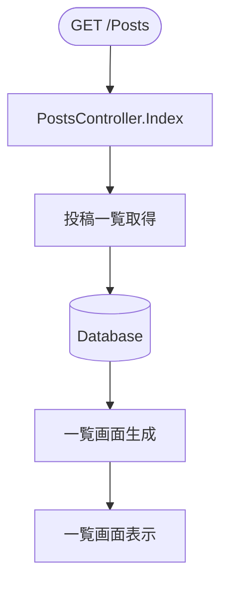
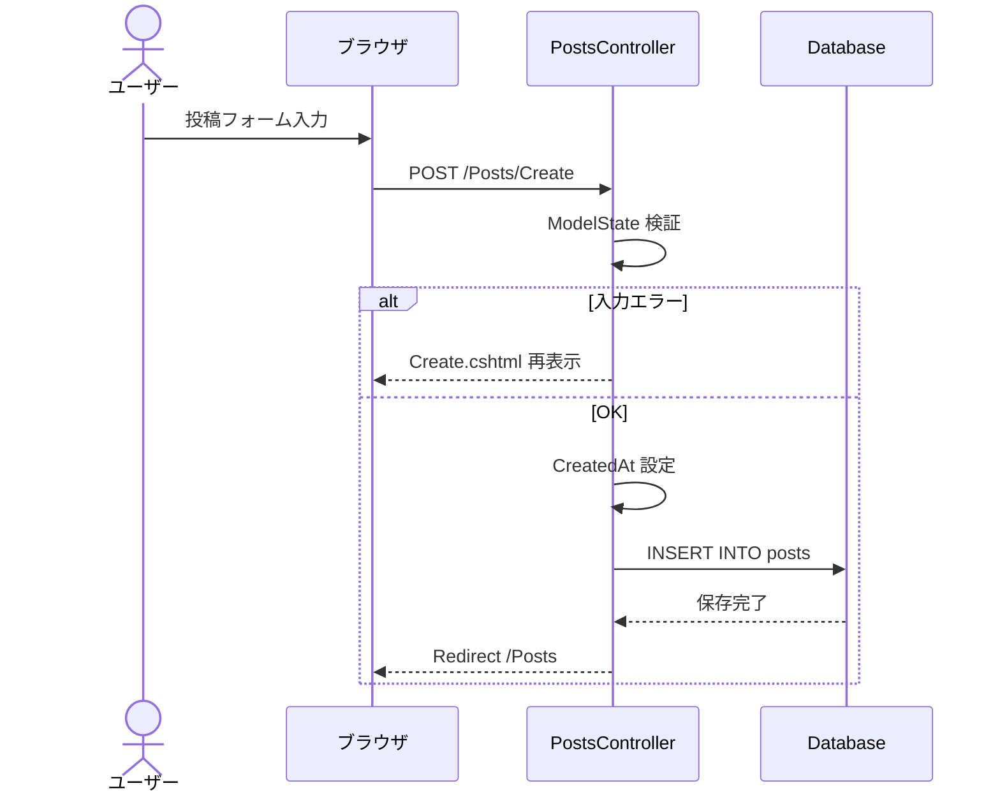
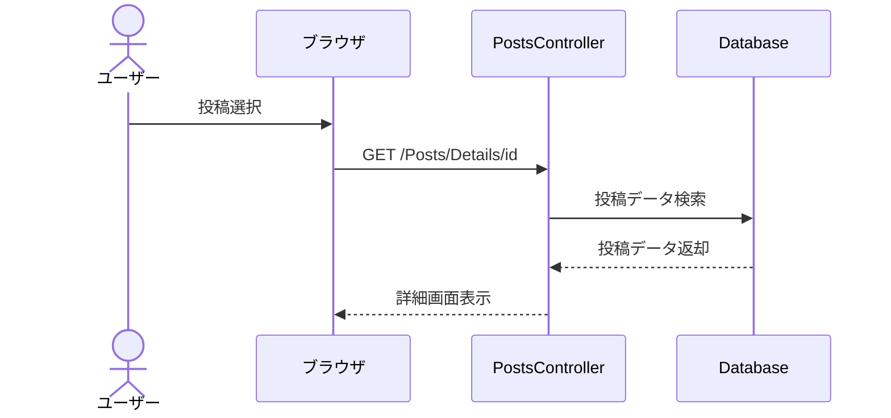
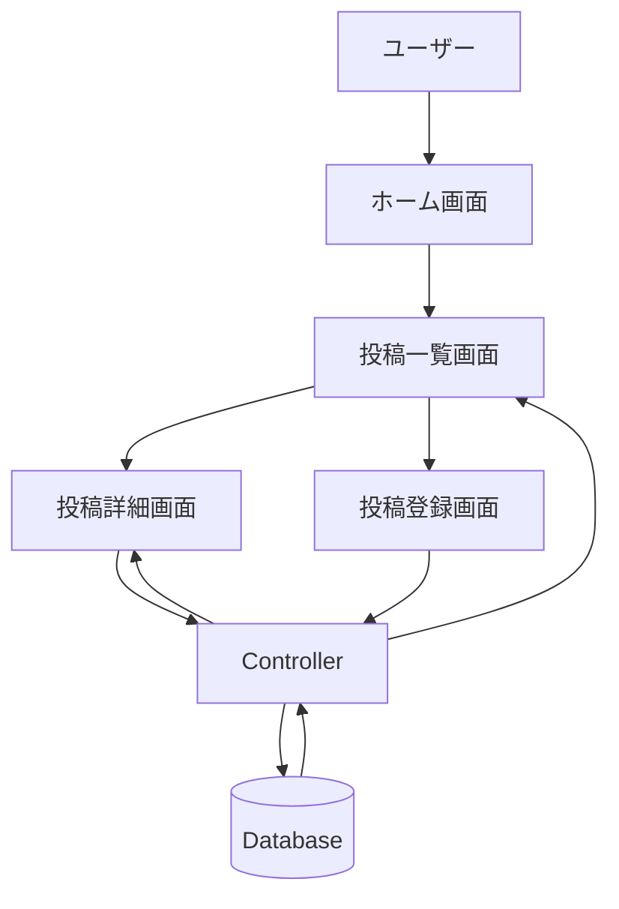
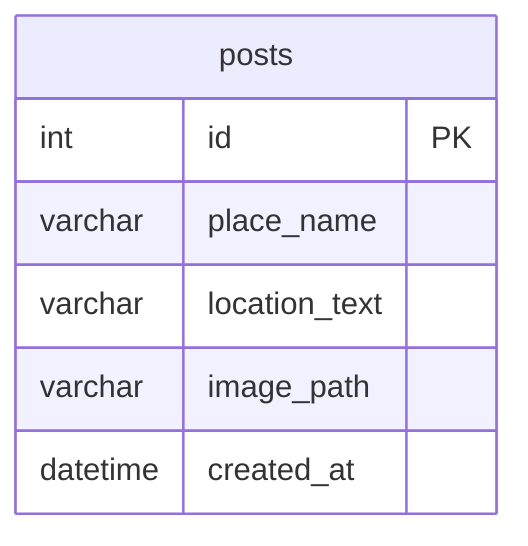

# 観光地のゴミ箱情報共有スレッド 内部設計書（ドラフト）

| 項目      | 内容                      |
| ------- | ----------------------- |
| プロジェクト名 | WebApp（観光地のゴミ箱情報共有スレッド） |
| バージョン   | 0.2（ドラフト）               |
| 作成日     | 2026-05-21              |
| ステータス   | レビュー前                   |

---

# 1. クラス図

## 1.1 モデル / DbContext / Controller 全体図

---

## 1.2 クラスの責務

| クラス                    | 種類        | 責務                              |
| ---------------------- | --------- | ------------------------------- |
| `Post`                 | エンティティ    | ごみ箱投稿情報を保持                      |
| `ApplicationDbContext` | DbContext | Entity Framework Core による DB 操作 |
| `HomeController`       | コントローラ    | ホーム画面表示                         |
| `PostsController`      | コントローラ    | 投稿一覧 / 詳細 / 登録処理                |

---

# 2. 処理フロー

## 2.1 投稿一覧表示

---

## 2.2 投稿登録

---

## 2.3 投稿詳細表示

---

## 2.4 システム全体フロー

---

# 3. テーブル定義書

## 3.1 ER図

---

## 3.2 テーブル定義

### 3.2.1 posts

| カラム           | 型            | NULL     | 説明      |
| ------------- | ------------ | -------- | ------- |
| id            | integer      | NOT NULL | 投稿ID    |
| place_name    | varchar(100) | NOT NULL | 観光地名    |
| location_text | varchar(100)         | NOT NULL | ごみ箱場所説明 |
| image_path    | varchar(100)         | NULL     | 投稿画像パス  |
| created_at    | datetime     | NOT NULL | 投稿日時    |

* 主キー: `id`

---

# 4. 今後の拡張案

* Google Maps API 連携
* 現在地表示
* 投稿編集・削除
* ログイン機能
* 管理者機能
* 多言語対応

